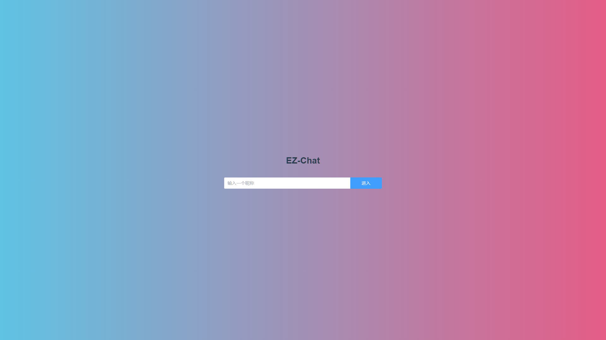
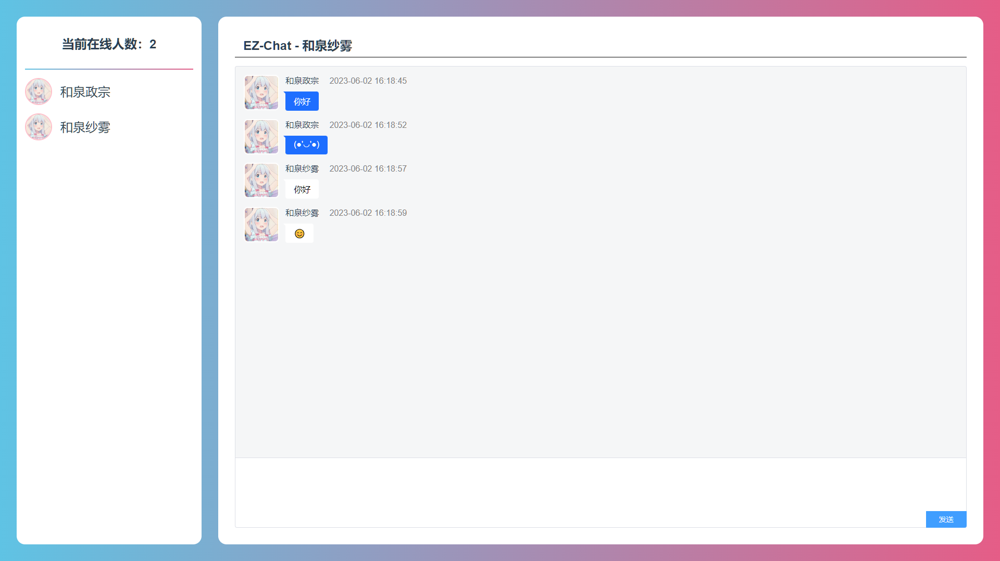
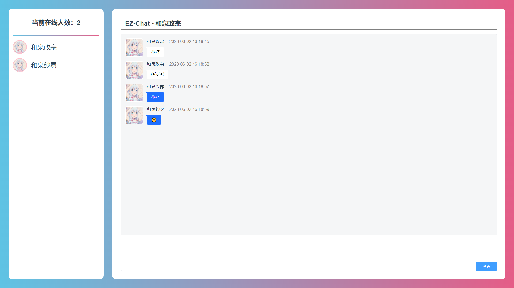
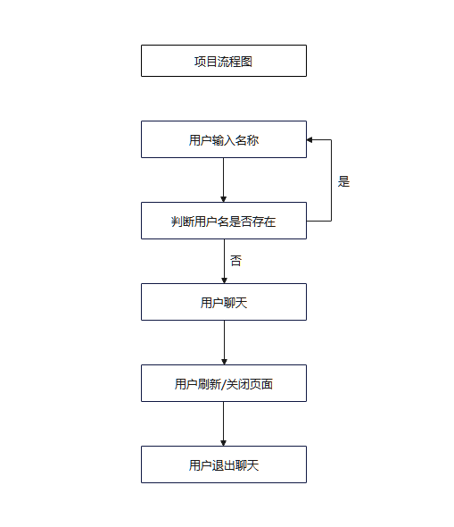

# EZ-Chat


名称：EZ-Chat

作者：KSaMar

日期：2023/5/31 - 2023/6/2

描述：一个好看简洁的在线多人聊天室


## 开发环境

开发软件：IDEA 2021.3.2

Node 版本：18.16.0

Java 版本：JDK 8

SpringBoot 版本：2.7.12


## 介绍

一个简单的 Vue + Element-Plus + SpringBoot + WebSocket 的在线多人匿名聊天的网页项目

输入一个昵称，即可在匿名聊天室中聊天，请不要在聊天室内透露个人信息，也不要发送某种言论

可以发送文本/符号表情与 emoji 表情 😊


chat-ui 是前端网页

chat-server 是后端服务


## 项目图片


### 主页




### 用户1




### 用户2




## 项目流程图




## 项目部署


### 前端

chat-ui

#### 安装
```
npm install
```


#### 开启服务

```
npm run serve
```


### 后端

chat-server

IDEA 打开 运行 ChatServerApplication.java
